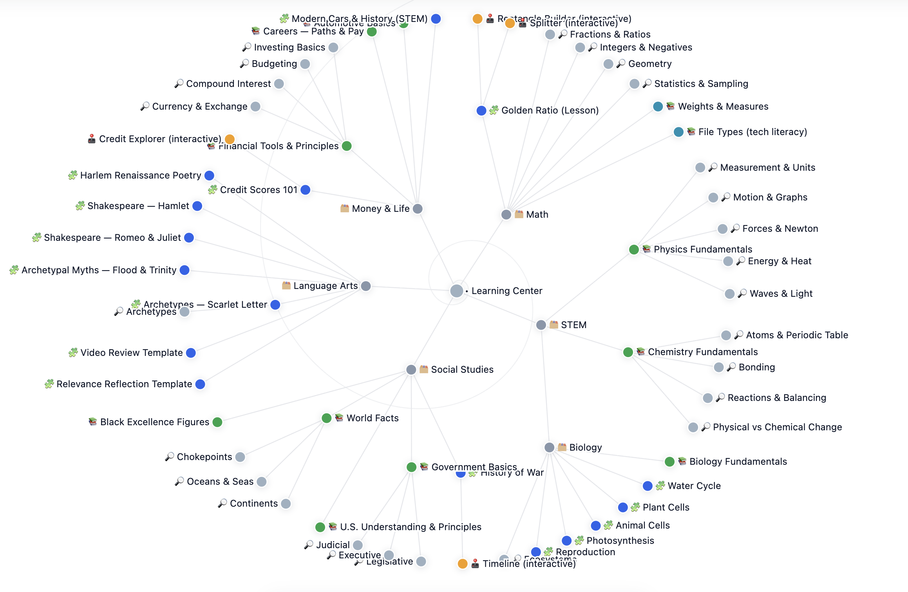

<div align="center">

# OpenTutor

**A parent-operated homeschool system built from GitHub, structured resources, teacher workflows, and optional AI support.**

<p>
  <a href="https://github.com/murderszn/open-tutor"></a>
  <a href="https://github.com/murderszn/vibe"></a>
  <a href="./teachers/ai-assistants/agents.md"></a>
  <a href="./resources/README.md"></a>
</p>

</div>


## Overview

OpenTutor is not a single app. It is a parent-operated homeschool system assembled from open tools on purpose.

- **This repo is the homeschool operating repo** for curriculum, resources, assignments, schedules, dashboards, and student work.
- **The companion Vibe repo** runs the Discord tutor, teacher assistant, and server admin layer.
- **GitHub** acts as the record of structure, revisions, and portfolio output.
- **Discord** can act as the daily classroom surface when you want live tutor support.
- **AI is optional and teacher-directed**. Adults define the work. AI helps draft, explain, organize, and review.

The point is not to buy into a canned curriculum platform. The point is to run a flexible, inspectable learning system that parents and teachers can shape over time.

## Two-Repo Model

OpenTutor works best when you treat the system as two connected repositories:

1. **OpenTutor repo**: the content system
   Curriculum areas, resources, assignments, student folders, schedules, dashboards, and teacher prompts live here.
2. **Vibe repo**: the tutor layer
   The Discord bot lives there and handles student tutoring, teacher assistance, and admin-gated classroom actions.

That separation matters. The content repo should stay understandable without the bot, and the bot should support the classroom without owning the curriculum.


## What This Repo Does

This repository is the maintained learning library and workflow engine for the homeschool.

- **Assignments** hold project briefs, labs, writing prompts, and interactive activities.
- **Resources** hold quick-reference guides, datasets, and reusable support material.
- **Students** hold personal workspaces, subject folders, and weekly schedules.
- **Teachers** hold dashboards, planning tools, and reusable AI assistant prompts.

This is deliberately **teacher-driven and AI-assisted**.

- There is no single fixed curriculum that must be followed.
- Suggested subject areas and materials help you get started.
- Parents and teachers decide what to teach, how far to go, and what artifacts students should produce.
- AI can help generate worksheets, rubrics, project prompts, study guides, summaries, and review materials from this structure.

## Visual Model

The larger system framing comes from the OpenTutor white paper in the Vibe project. Inside this repo, the closest curriculum-level graphic is the learning-center mind map.



Useful entry points:

- [Weekly Timeline Dashboard](./teachers/sites/index.html)
- [Curriculum Mind Map](./teachers/sites/mind-map/index.html)
- [AI Teaching Team](./teachers/ai-assistants/agents.md)
- [Teacher Tools](./teachers/tools/README.md)
- [Assignments Index](./assignments/README.md)
- [Resources Index](./resources/README.md)

## Daily Workflow

OpenTutor is built around a repeatable teacher workflow rather than a locked product flow:

1. **Plan the week**
   Define goals, edit `schedule.csv`, choose assignments, and decide what resources matter now.
2. **Stage the materials**
   Pull from `resources/`, create or revise assignments, and add links, datasets, or guides students will need.
3. **Run the day**
   Students open their workspace, check the schedule, complete work in subject folders, and ask for help when blocked.
4. **Review and respond**
   Teachers give feedback, adjust pacing, add follow-up work, and refine the next set of tasks.
5. **Build the portfolio**
   Student output stays in folders and commits, creating a visible academic record over time.

If you use Vibe, Discord becomes the live help desk. If you do not, this repo still works as a structured homeschool system on its own.

## Quick Start

### 1. Clone the repo

```bash
git clone https://github.com/murderszn/open-tutor.git
cd open-tutor
```

### 2. Set up the core accounts

Each participant should have:

- a GitHub account: <https://github.com/signup>
- a code editor, preferably VS Code: <https://code.visualstudio.com/Download>
- a Discord account if you plan to use the Vibe tutor: <https://discord.com>

### 3. Create a student workspace

```bash
cp -r students/student-template students/your-student-name
```

Then update the copied workspace:

- replace `[STUDENT_NAME]` in the student's `README.md`
- rename `grade-N/` to the actual grade
- adjust subject folders to match that student's program
- edit `students/<name>/schedule.csv` with the week's work

Example schedule row:

```csv
Week,Study Area,Task,Status
"September 6, 2026",Math,Complete weekly math practice,Pending
```

### 4. Open the dashboards

- [Weekly Timeline Dashboard](./teachers/sites/index.html)
- [Curriculum Mind Map](./teachers/sites/mind-map/index.html)
- [Student Sprint Board](./students/sprint.html)

## Repository Structure

```text
open-tutor/
├── assignments/          shared assignments, projects, and interactives
├── resources/            reference guides, study docs, and datasets
├── students/             one workspace per student
├── teachers/
│   ├── ai-assistants/    reusable prompts for planning, tutoring, grading
│   ├── reports/          generated report materials
│   ├── sites/            dashboards and visual planning tools
│   └── tools/            classroom-ready interactive teacher tools
└── .github/workflows/    optional hosting automation
```

### Student Workspace Model

Each student gets a durable workspace that can accumulate real work over time:

```text
students/student-name/
  grade-5/
    math/
    stem/
    language-arts/
    social-studies/
  schedule.csv
  README.md
```

This repo structure is meant to produce actual artifacts:

- essays
- worksheets
- lab reports
- presentations
- code projects
- research notes
- portfolio pieces

## Teacher Workflow

This repo assumes adults are the operators.

- **Teachers and parents curate the resource base**
  Keep guides, links, references, and datasets organized in `resources/`.
- **Teachers create the work**
  Build assignments, prompts, projects, and rubrics in `assignments/`.
- **Teachers manage pacing**
  Use student schedules and dashboards to shape the weekly rhythm.
- **AI helps with production**
  Use the prompts in `teachers/ai-assistants/` to draft materials faster and respond to student needs.

OpenTutor is not trying to replace the teacher. It is trying to give the teacher better structure, leverage, and visibility.

## AI Teaching Team

This repo includes a reusable prompt library for running the program with any major AI assistant.

| Agent | File | Primary use |
|---|---|---|
| Curriculum Creator | [curriculum_creator.md](./teachers/ai-assistants/curriculum_creator.md) | Design units, projects, and prompts |
| Lesson Planner | [lesson_planner.md](./teachers/ai-assistants/lesson_planner.md) | Turn goals into daily and weekly tasks |
| Teacher's Aide | [teachers_aide.md](./teachers/ai-assistants/teachers_aide.md) | Unblock students without giving answers |
| Subject Tutor | [subject_tutor.md](./teachers/ai-assistants/subject_tutor.md) | Explain new topics clearly and step by step |
| Assessment Grader | [assessment_grader.md](./teachers/ai-assistants/assessment_grader.md) | Grade work against a rubric |
| Report Card Generator | [report_card_generator.md](./teachers/ai-assistants/report_card_generator.md) | Turn work into progress reports |
| Resource Finder | [resource_finder.md](./teachers/ai-assistants/resource_finder.md) | Curate age-appropriate videos and references |

Full directory: [teachers/ai-assistants/agents.md](./teachers/ai-assistants/agents.md)

## Learning Resources

The `resources/` folder is a maintained library, not a locked curriculum.

- quick-reference guides for science, history, finance, careers, government, and practical life knowledge
- structured datasets in CSV and JSON for coding, research, and analysis
- reusable materials that students can reopen without rebuilding context from scratch

Start here: [resources/README.md](./resources/README.md)

## Assignments and Projects

The `assignments/` folder holds the work students actually do.

- subject-based assignments
- project prompts
- labs and interactives
- writing and research tasks
- templates and scaffolds

Start here: [assignments/README.md](./assignments/README.md)

## Optional Discord Tutor Layer

If you want live tutor support inside a classroom server, use the companion Vibe repo:

- Vibe repo: <https://github.com/murderszn/vibe>
- Project site / white paper: <https://discord-vibe-bot.vercel.app>

Vibe is designed to operate as:

- a tutor for students
- an assistant for teachers
- an admin-gated helper for the Discord server

That means OpenTutor can stay focused on content and workflow while Vibe handles real-time help inside Discord.

## Privacy and Safety

- Use first names only in student folders and content.
- Keep sensitive student records in a private fork or private repository.
- Do not commit secrets, `.env` files, or real PII.
- Keep adult review in the loop when using AI-generated materials.
- Treat AI output as draft support, not automatic truth.

## Hosting

This repo can be browsed locally with no build step, or hosted statically.

To preview locally:

```bash
python3 -m http.server 8000
```

Then open:

- `http://localhost:8000/teachers/sites/index.html`
- `http://localhost:8000/teachers/sites/mind-map/index.html`

Firebase hosting is also preconfigured in `.github/workflows/firebase-hosting.yml` if you want automated static deployment.

## Summary

OpenTutor is the curriculum and workflow repo in a larger parent-operated learning system. It gives teachers and families a structured way to organize resources, design assignments, manage schedules, and preserve student work, while optionally connecting to Vibe for live AI tutoring inside Discord.
