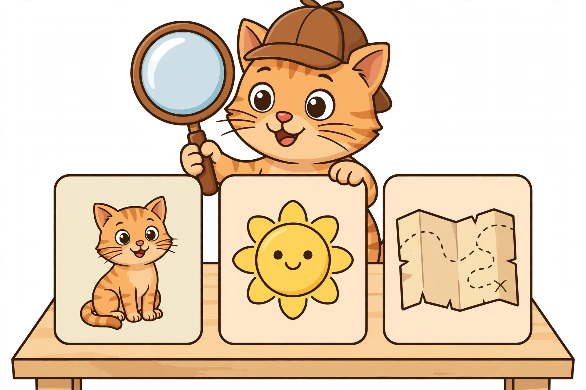

# Lesson 04 — Sound Detective: First, Middle, Last

**Goal (learner hears):** "I can be a sound detective and name the first,
middle, and last sounds in a word."
**Time:** 20–25 minutes · **Materials:** the generated illustration
[`assets/sound-detective.png`](../assets/sound-detective.png); 3 sound
dots or chips; a small mirror (optional).
**Standards:** RF.1.2, RF.1.2.c.

## Readiness check (1–2 min)

Show the illustration. "This is the Sound Detective. She has three clue
cards. Detective rule: every word hides three clues — the **first**
sound, the **middle** sound, and the **last** sound. Let's look at her
first card." (Do not name the objects yet — let the learner name them.)

*Caption: "An AI-generated Sound Detective scene. She has three clue
cards — no words on them, only pictures. Your ears must find the sounds."*
*Alt text: "A cheerful cartoon kitten detective wearing a brown
deerstalker cap holds a large round magnifying glass. On a wooden table in
front of her stand three upright picture cards: a sitting tabby cat, a
smiling yellow sun, and a folded treasure map with a dotted trail."*
*Text-only alternative: the three cards show a cat, a sun, and a map.
All activity questions below name these objects in words, so the activity
works fully without the image.*

## Explicit teaching

A sound detective asks three questions about every word:

1. **First sound** — "What sound starts the word?" (Put up 1 finger.)
2. **Middle sound** — "What vowel sound is hiding in the middle?" (2
   fingers — the middle is almost always a vowel.)
3. **Last sound** — "What sound ends the word?" (3 fingers.)

Say the word **slowly**, like taffy stretching. Catch each sound as it
comes. The middle sound is the detective's favorite clue — it tells you
which vowel team the word belongs to (remember Lesson 03!).

### Modeled example 1 — the cat card

*Adult points to the cat card and thinks aloud like a detective:*
"Card one: a **cat**. Say it slowly with me: c-ă-t."
"First sound: /k/." *(1 finger up.)* "Middle sound: /ă/ — that's the
vowel, the short-a team!" *(2 fingers.)* "Last sound: /t/." *(3 fingers.)*
"Case solved: **cat = /k/ /ă/ /t/**."
*Adult covers the card:* "Now from memory — what was the middle sound of
'cat'?" *(Waits.)* "/ă/! The middle is the vowel — it never hides for
long."

### Modeled example 2 — the sun card, then the map card

*Adult points to the sun card:* "Card two: **sun**. S-ŭ-n. First: /s/.
Middle: /ŭ/ — short-u team. Last: /n/. **Sun = /s/ /ŭ/ /n/**."
*Adult points to the map card:* "Card three: **map**. M-ă-p. First: /m/.
Middle: /ă/ — hey, same middle as 'cat'! Both short-a. Last: /p/.
**Map = /m/ /ă/ /p/**."
"Two cases had the same middle clue. Detectives notice patterns — that's
how word families are born (see Lesson 06)."

## Guided practice (adult does it with the learner; 5 tasks)

1. "Your turn, detective. Card one again: 'cat.' Give me the first
   sound." (/k/)
2. "The middle sound?" (/ă/ — "the vowel!")
3. "The last sound?" (/t/)
4. "New case, no card: 'dog.' First, middle, last?" (/d/ /ŏ/ /g/)
5. "Tricky case: 'fish.' First, middle, last?" (Accept /f/ /ĭ/ /sh/ as
   one last sound OR /f/ /ĭ/ /ʃ/ — note it; the /sh/ team gets its full
   lesson in Unit 02.)

## Independent practice (learner tries; adult observes, 5 tasks)

1. "Pig." First, middle, last. (/p/ /ĭ/ /g/)
2. "Cup." First, middle, last. (/k/ /ŭ/ /p/)
3. "Ten." First, middle, last. (/t/ /ĕ/ /n/)
4. **Which card?** "I am thinking of a card whose middle sound is /ŭ/."
   (The sun card.) "How did you solve it?" ("Sun's middle is /ŭ/.")
5. **Error-analysis:** the adult says "'Bed': first /b/, middle /ĕ/,
   last... /d/? No wait — last /t/!" The learner rules: "It's /d/!
   Bed ends with /d/, not /t/." (If the learner genuinely hears /t/,
   say both: "bed... bet. Hear the difference? /d/ buzzes.")

## Application

"Detective notebook." The learner picks any 3 words from the unit word
sets, draws a quick clue card for each (a simple picture), and dictates
or writes the three sounds under it: first, middle, last. The adult
checks each case like a chief inspector stamping "SOLVED". One card must
use a short vowel the learner found tricky this week.

## Exit check

1. "'Hot.' First sound?" (/h/)
2. "'Hot.' Middle sound?" (/ŏ/)
3. "'Hot.' Last sound?" (/t/)
4. "Why is the middle sound the detective's favorite clue?" (It's the
   vowel — it tells which vowel team the word belongs to.)

## Supports and extension

- **Language access:** practice first/middle/last with the learner's own
  name ("What sound starts your name? What's the last sound?") before
  word-list words.
- **Alternate response mode:** the learner may hold up 1, 2, or 3
  fingers to answer "which sound?" questions, then say only that sound.
- **Seated-table variant:** three sound dots in a row — touch and say
  each sound; slide a chip off for the target sound.
- **Floor-play variant:** three floor spots labeled 1-2-3 — the learner
  stands on the spot for the sound the adult asks for, then says it.
- **Extension:** solve 4-sound cases ("stop": /s/ /t/ /ŏ/ /p/ — which
  two sounds hold hands at the start?); name the middle vowel team.

## Teacher note — likely misconceptions

- *The middle sound is the hardest:* children hear first and last
  easily; the middle vowel blurs. Stretch it extra long ("c-ăăă-t") and
  use the mirror — the mouth opens widest on the vowel.
- *Naming the letter instead of the sound:* "the first sound of 'cat'
  is CEE." Accept, then reshape: "The letter is C; the sound is /k/ —
  detectives report sounds."
- */b/ vs. /d/ at the start:* "bed" vs. "dead". Have the learner watch
  your mouth in the mirror — /b/ uses both lips, /d/ uses the tongue.

**Answer-key reference:** [answer-key.md](../answer-key.md#lesson-04) —
acceptable responses for the exit check and application.
