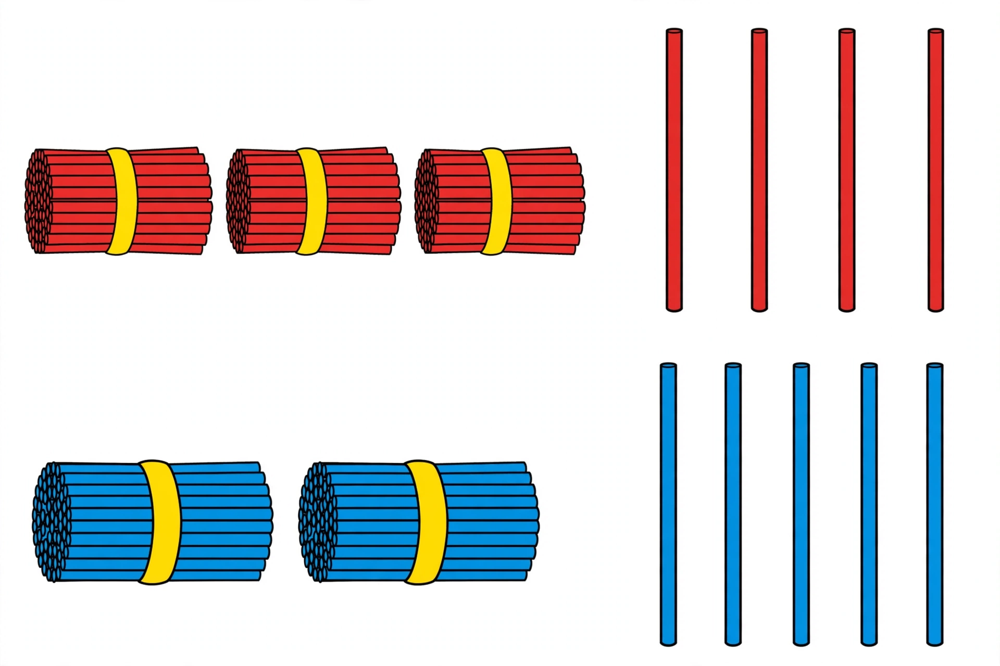

# Lesson 05 — Compare Two-Digit Numbers

**Student goal:** I can tell which of two numbers is greater by comparing
tens first, then ones, and I can write the comparison with `>`, `=`, or `<`.
**Time:** 20–25 minutes · **Unit:** [U01](../README.md) · **Session 13 of 16**
(second half of the combined core session)

## Materials

- The generated illustration
  [`assets/tens-and-ones-compare.png`](../assets/tens-and-ones-compare.png)
  (printed or on screen), plus its text alternative
- Bundles and loose straws for re-building comparisons
- Symbol cards: `>`, `<`, `=`

## Readiness check (2 minutes)

Show 3 bundles vs. 2 bundles: "Which is more straws? How do you know?"
(Expected: 3 bundles = 30 > 20.) If bundle comparison is shaky, re-do Lesson
02's exit check first.

## Teaching

Comparing two-digit numbers is a race the **tens** usually win:

1. **Compare the tens first.** More tens = greater number. Fewer tens =
   smaller number. Done — the ones don't matter.
2. **If the tens are equal, compare the ones.** More ones = greater number.
3. Write the symbol with the **open mouth toward the greater number**:
   the hungry crocodile eats the bigger one. `34 > 25` reads "34 is greater
   than 25." `=` means both sides are the same amount.

> "Never start with the ones. A single extra ten beats nine extra ones —
> 30 is greater than 29, even though 9 ones is more than 0 ones."

**Key vocabulary:** *compare*, *greater than* (`>`), *less than* (`<`),
*equal to* (`=`).

*Caption: An AI-generated picture of straw bundles. Top row: red bundles
and loose straws. Bottom row: blue bundles and loose straws. How many in
each row — and which row has more?*

*Alt text: Two rows of straw bundles on white. Top row: 3 red bundles of
straws and 4 loose red straws. Bottom row: 2 blue bundles of straws and
5 loose blue straws.*

*Text-only alternative: The picture shows 3 bundles and 4 loose red straws
(34 straws) in the top row, and 2 bundles and 5 loose blue straws (25
straws) in the bottom row.*

## Worked example 1 — 34 vs. 25 (the illustration)

Point to the top row of the picture with the learner.

> "Top row: count the bundles — one ten, two tens, three tens. Now the
> loose ones: 1, 2, 3, 4. Three tens and four ones = **34**."
> "Bottom row: two bundles = two tens. Loose ones: 1, 2, 3, 4, 5. Two tens
> and five ones = **25**."
> "Compare the tens first: 3 tens vs. 2 tens. Three tens is more, so 34 is
> greater than 25. Write: **34 > 25**."

**Reasoning to name aloud:** the tens decided it — 3 beats 2. We didn't even
need the ones. (Note: if the learner wants to check by counting all 34 and
all 25 straws, let them — then show the tens shortcut is faster.)

## Worked example 2 — when the tens tie: 46 vs. 43

Build both with real straws (or draw): 4 bundles + 6 loose vs. 4 bundles
+ 3 loose.

> "Tens first: 4 tens and 4 tens — a tie! So we look at the ones: 6 ones vs.
> 3 ones. Six is more. **46 > 43**."
> "And watch: 29 vs. 30. Tens: 2 vs. 3 — three tens wins, so **30 > 29**,
> even though 9 ones is more than 0 ones. The tens outrank the ones."

**Reasoning to name aloud:** ones only get a vote when the tens tie. This is
the most common error to watch for — learners who compare 9 ones vs. 0 ones
first.

## Guided practice (adult stays close, hints allowed)

Do 4–6 short rounds. Always: tens first, then ones, then symbol.

1. Build 52 vs. 37 with straws: "Compare tens. Write the comparison."
   (Expected: 5 tens > 3 tens; 52 > 37.)
2. 61 vs. 68: "Tens tie — now the ones." (Expected: 61 < 68.)
3. 40 vs. 14: (Expected: 40 > 14.)
4. 25 vs. 25: "What symbol when they're the same?" (Expected: 25 = 25.)
5. Error analysis: the adult writes "29 > 31 because 9 ones is more than 1
   one." Ask: "Right or wrong? Fix it." (Expected: wrong — compare tens
   first: 2 tens < 3 tens, so 29 < 31.)
6. Picture round: "Using the illustration, which row has fewer straws? Write
   it." (Expected: 25 < 34.)

## Independent practice

The learner writes and solves 4 comparisons: 73 vs. 37, 55 vs. 59, 80 vs. 80,
96 vs. 69 — tens first, then ones, then the symbol, with one sentence of
reasoning each ("7 tens beats 3 tens"). The adult checks symbols and
reasoning.

*Alternate response mode:* say the comparison aloud and point to the symbol
card; the adult writes.

## Application

Card game: two players each draw a number card 10–99 and build it with
bundles and loose straws (or just read the digits as tens and ones). "Whose
number is greater? Show the tens-then-ones reasoning." The greater number
keeps both cards. Tens-first reasoning is now a game strategy.

## Exit check

"Compare 62 and 26. Tell me the tens, then the ones, then write the
comparison." Expected: "6 tens vs. 2 tens — 6 is more — 62 > 26." Record:
secure / developing / not yet.

## Supports

- **Language access:** read `34 > 25` aloud as "34 is greater than 25" every
  time; never read the symbol as "arrow."
- **Alternate response mode:** point to symbol cards; build both numbers with
  manipulatives and point to the winning row.
- **Floor-play variant:** lay out two rows of bundled straw towers on the
  floor; the learner stands by the greater row and says why.

## Extension

Order three numbers: 58, 85, 55 — greatest to least. Or: "Fill the blank:
4_ > 47. What digits work?" (any 8 or 9; 48, 49) — reasoning about the
ones place when tens tie.

## Teacher note

**Likely misconceptions:** (1) comparing the ones digit first (29 > 31) —
always chant "tens first"; (2) reading `>` as an arrow pointing at the
smaller number — use the hungry-mouth story and read aloud; (3) thinking a
longer-looking loose pile beats a bundle — rebuild both sides with bundles
so the tens are visible as objects.

**Answer-key reference:** [answer-key.md](../answer-key.md#lesson-05) has the
expected responses for the guided error-analysis round and exit check.
