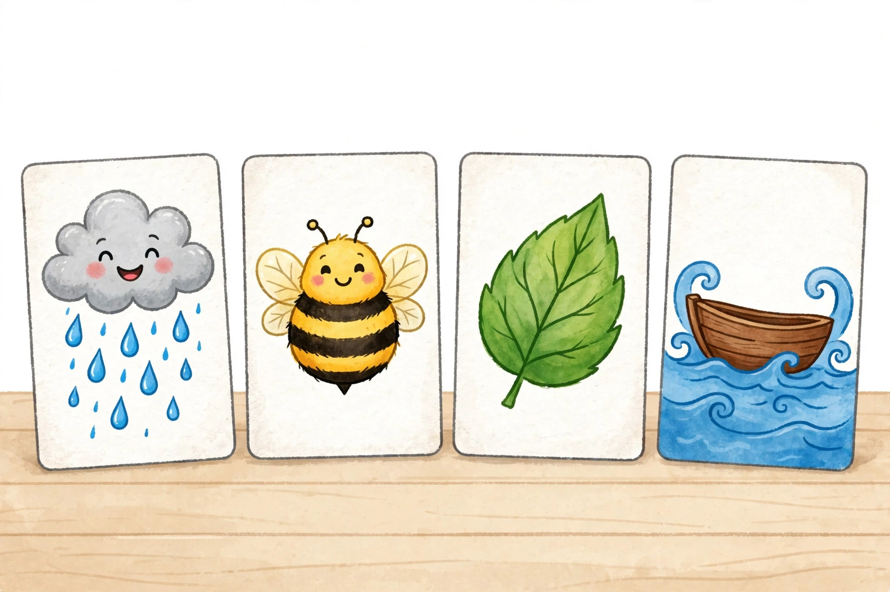

# Lesson 02 — Two Letters, One Sound: ai/ay and ee/ea

**Goal (learner hears):** "I can read words where two vowels team up to make one long sound."
**Time:** 25–30 minutes · **Materials:** the generated illustration
[`assets/vowel-team-friends.png`](../assets/vowel-team-friends.png); the
unit word sets; letter tiles.
**Standards:** RF.2.3.b.

## Readiness check (1–2 min)

Show the illustration (do not name the objects yet — let the learner name them).

*Caption: "An AI-generated picture. Four friends, no words — only your ears know which vowel team each one hides."*
*Alt text: "Four upright picture cards on a light wooden table. From left: a smiling gray rain cloud with blue raindrops falling; a chubby yellow-and-black bumblebee with round wings; a bright green leaf with visible veins; a small brown wooden boat floating on blue wavy water."*
*Text-only alternative: the four cards show rain, a bee, a leaf, and a boat. Every activity below names these objects in words, so the lesson works fully without the image.*

"Meet four friends. Card one: **rain**. Stretch the middle: r-āāā-n.
The /ā/ sound is spelled with TWO letters: **ai**. Card two: **bee** —
b-ēēē, spelled **ee**. Card three: **leaf** — l-ēēēf, spelled **ea**.
Card four: **boat** — b-ōōōt, spelled **oa**. Each friend hides one vowel
team."

## Explicit teaching

A **vowel team** is two (sometimes three) letters that stand side by side
and make exactly one vowel sound. The first vowel usually does the talking
— it says its long name — and the second vowel is quiet. "*ai* says /ā/,
*ee* and *ea* say /ē/."

Position matters, and it is a pattern you can trust most of the time:

- **ai** usually sits in the *middle* of a word: *rain, train, paint, wait, snail*.
- **ay** usually sits at the *end* of a word: *day, play, say, away, clay*.
  Same sound (/ā/), different seat.
- **ee** and **ea** both say /ē/, in any seat: *bee, see, tree, green,
  leaf, read, sea, each, dream, clean*.

When you meet a new word, read it in three steps: **spot** the team,
**say** its long sound, **blend** the whole word.

### Modeled example 1 — train

*Adult writes* train *and thinks aloud:*
"Four letters after the t? No — look for the team. I see **ai** in the
middle. *ai* says /ā/. Spot — say — blend: /t/ /r/ /ā/ /n/ … *train*,
like a train on tracks."
*Adult covers the word:* "Say it again from the team: ai says… /ā/…
*train*." (Waits for the learner to echo.)

### Modeled example 2 — play, then leaf

*Adult writes* play: "The team is at the end — **ay**. Same /ā/ sound,
different seat. /p/ /l/ /ā/ … *play*."
*Adult writes* leaf: "Team **ea** — says /ē/. /l/ /ē/ /f/ … *leaf*,
like the green leaf on card three. Two teams, both saying /ē/ — *ee*
and *ea* are sound twins with different spelling."

## Guided practice (adult does it with the learner; 5 tasks)

1. Point to the rain card. "What is it? What team does its name hide?"
   (*rain* — **ai**.)
2. "Read *wait* with the three steps." (Spot **ai** — say /ā/ — blend: *wait*.)
3. "Read *day*." (Team at the end: **ay** — *day*.) "Why ay and not ai?"
   (It's at the end of the word.)
4. Point to the bee card. "Read *green*." (Spot **ee** — say /ē/ — blend: *green*.) "Now *sea*." (**ea** — *sea*.)
5. **Error-analysis:** the adult reads *paint* as "pant." "Did I read that
   right?" (No — the **ai** team says /ā/: *paint*.) "What did I skip?"
   (The team — I read it as a short-a word.)

## Independent practice (learner tries; adult observes, 5 tasks)

1. Build with tiles, then read: *rain, day, bee, leaf*. Name each team aloud.
2. Sort 8 word cards into four team trays — ai, ay, ee, ea: *train, say,
   tree, each, snail, clay, see, dream*.
3. "Which two teams say /ē/?" (*ee* and *ea*.) "Give me one word for each."
4. Read these two original sentences (adult points under each word):
   "The rain came down on the green leaf." / "The bee sat by the sea to read."
5. **Explain-your-reasoning:** "How do you know *play* is not spelled
   p-l-a-i?" (*ai* sits in the middle; at the end of a word the /ā/ team
   is spelled *ay*.)

## Application

"Team tag." The learner chooses one friend card (rain, bee, leaf, or boat)
and hunts through the unit word sets for 5 more words with the same team,
writing or dictating each (adult scribes if needed). Then the learner reads
the full set of 6 back, pointing at the team in each word and saying the
sound before blending. The collection goes into the learner's word tray for
the vowel-team sort in Practice C.

## Exit check

1. Read *away*. (Long /ā/ — **ay** at the end.)
2. Read *clean*. (Long /ē/ — **ea**.)
3. "What sound does *ai* make, and where does it usually sit?" (/ā/ — in the middle.)
4. Point to the leaf card: "Which team, which sound?" (**ea** — /ē/.)

## Supports and extension

- **Language access:** before print, play the ear game — "I say *day*,
  you say the middle sound" (/ā/) — with the four friend names.
- **Alternate response mode:** the learner may point to the friend card
  instead of naming the team, then read the word.
- **Seated-table variant:** four trays with the friend cards taped on —
  sort word cards under the right friend.
- **Floor-play variant:** four floor spots, one friend card each — the
  learner carries each word card to its friend.
- **Extension:** find ai/ay/ee/ea words in a picture book (6 examples);
  test the "ai in the middle, ay at the end" pattern — does it ever break?
  (It bends: *said* has *ai* saying /ĕ/ — a case for Lesson 06.)

## Teacher note — likely misconceptions

- *Two letters, two sounds:* learners may sound out r-a-i-n letter by
  letter. Cover the team with a finger: "The team is one sound. Say /ā/,
  then blend."
- *ay vs. ai confusion:* anchor to position, not memory — "Where in the
  word? End means ay."
- *ee/ea both say /ē/:* reassure — "Two spellings, one sound. Reading
  works the same; spelling picks later."
- *Answer-key reference:* see [answer-key.md](../answer-key.md#lesson-02) —
  all guided/independent items solved and reconciled.
