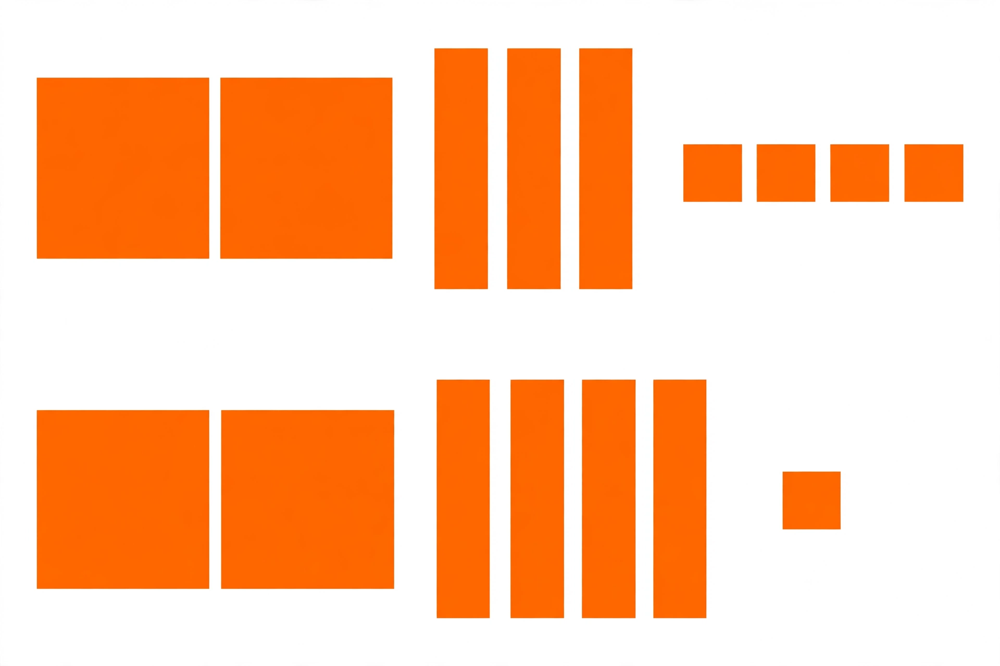

# Lesson 05 — Compare Three-Digit Numbers

**Student goal:** I can tell which of two three-digit numbers is greater by
comparing hundreds first, then tens, then ones, and I can write the
comparison with `>`, `=`, or `<`.
**Time:** 25–30 minutes · **Unit:** [U01](../README.md) · **Session 13 of 16**

## Materials

- The generated illustration
  [`assets/compare-234-vs-241.png`](../assets/compare-234-vs-241.png)
  (printed or on screen), plus its text alternative
- Hundred-flats, ten-rods, one-cubes for re-building comparisons
- Symbol cards: `>`, `<`, `=`

## Readiness check (2 minutes)

"Build 300 and 200. Which is greater? How do you know?" (Expected: 3 flats
> 2 flats; 300 > 200.) If hundreds comparison is shaky, re-do Lesson 01's
counting first.

## Teaching

Comparing three-digit numbers is a race the **hundreds** usually win:

1. **Compare the hundreds first.** More hundreds = greater number. Done —
   the tens and ones don't matter.
2. **If the hundreds are equal, compare the tens.** More tens = greater.
3. **If the tens are also equal, compare the ones.**
4. Write the symbol with the **open mouth toward the greater number**:
   241 > 234 reads "241 is greater than 234." `=` means both sides are the
   same amount.

> "Never start with the ones. One extra hundred beats ninety-nine extra
> tens and ones — 300 is greater than 299, even though 99 is more than 0."

**Key vocabulary:** *compare*, *greater than* (`>`), *less than* (`<`),
*equal to* (`=`).

*Caption: An AI-generated picture of base-ten blocks. Top row: big squares,
tall bars, and tiny squares. Bottom row: the same kinds of blocks. What
number does each row show — and which is greater?*

*Alt text: Two rows of solid orange base-ten blocks on white. Top row:
2 large squares, 3 tall bars, 4 tiny squares. Bottom row: 2 large squares,
4 tall bars, 1 tiny square.*

*Text-only alternative: The picture shows 2 hundreds, 3 tens, and 4 ones
(234) in the top row, and 2 hundreds, 4 tens, and 1 one (241) in the bottom
row.*

## Worked example 1 — 234 vs. 241 (the illustration)

Point to the top row of the picture with the learner. (In this picture the
large squares are hundreds, the tall bars are tens, and the tiny squares are
ones — the learner verified these units with their own blocks in Lessons
01–02.)

> "Top row: 2 large squares = 2 hundreds. 3 bars = 3 tens. 4 tiny squares =
> 4 ones. Two hundreds, three tens, four ones = **234**."
> "Bottom row: 2 large squares = 2 hundreds. 4 bars = 4 tens. 1 tiny square =
> 1 one. Two hundreds, four tens, one one = **241**."
> "Compare the hundreds first: 2 hundreds vs. 2 hundreds — a tie! So compare
> the tens: 3 tens vs. 4 tens. Four tens is more, so 241 is greater than 234.
> Write: **234 < 241**."

**Reasoning to name aloud:** the hundreds tied, so the tens got the deciding
vote — and the ones never mattered. (If the learner wants to check by
counting everything, let them — then show the hundreds-first shortcut is
faster.)

## Worked example 2 — the zero-tens trap: 405 vs. 450

Build both with real blocks: 4 flats + 0 rods + 5 cubes vs. 4 flats + 5 rods
+ 0 cubes.

> "Hundreds first: 4 vs. 4 — tie. Tens: 0 tens vs. 5 tens. Five tens wins,
> so **405 < 450**."
> "Watch the trap: 450 *looks* like it has a zero and 405 *looks* busier,
> but the tens place decides. Zero tens is still a real comparison — 0 < 5."

**Reasoning to name aloud:** zero is a contestant, not an absence. This is
the most common error to watch for — learners who skip the zero and compare
ones first.

## Guided practice (adult stays close, hints allowed)

Do 4–6 short rounds. Always: hundreds first, then tens, then ones, then symbol.

1. Build 512 vs. 387: "Compare hundreds. Write the comparison."
   (Expected: 5 hundreds > 3 hundreds; 512 > 387.)
2. 624 vs. 642: "Hundreds tie — now the tens." (Expected: 624 < 642.)
3. 709 vs. 790: (Expected: 709 < 790 — zero tens loses to 9 tens.)
4. 456 vs. 456: "What symbol when they're the same?" (Expected: 456 = 456.)
5. Error analysis: the adult writes "318 > 321 because 8 ones is more than
   1 one." Ask: "Right or wrong? Fix it." (Expected: wrong — compare
   hundreds first: 3 = 3, then tens: 1 ten < 2 tens, so 318 < 321.)
6. Picture round: "Using the illustration, which row shows the smaller
   number? Write it." (Expected: 234 < 241.)

## Independent practice

The learner writes and solves 4 comparisons: 735 vs. 375, 508 vs. 580, 666
vs. 666, 904 vs. 940 — hundreds first, then tens, then ones, with one
sentence of reasoning each ("9 hundreds beats 9 hundreds? No — tie; 0 tens
vs. 4 tens: 904 < 940"). The adult checks symbols and reasoning.

*Alternate response mode:* say the comparison aloud and point to the symbol
card; the adult writes.

## Application

Card game: two players each draw a number card 100–999 and build it (or just
read the digits as hundreds, tens, ones). "Whose number is greater? Show the
hundreds-then-tens-then-ones reasoning." The greater number keeps both
cards. Hundreds-first reasoning is now a game strategy.

## Exit check

"Compare 562 and 526. Tell me the hundreds, then the tens, then write the
comparison." Expected: "5 hundreds vs. 5 hundreds — tie; 6 tens vs. 2 tens —
6 is more — 562 > 526." Record: secure / developing / not yet.

## Supports

- **Language access:** read `234 < 241` aloud as "234 is less than 241"
  every time; never read the symbol as an arrow.
- **Alternate response mode:** point to symbol cards; build both numbers with
  blocks and point to the winning row.
- **Floor-play variant:** lay out two rows of block builds on the floor; the
  learner stands by the greater row and says why.

## Extension

Order three numbers: 581, 815, 518 — greatest to least. (815, 581, 518.)
Or: "Fill the blank: 3_7 < 342. What digits work?" (0, 1, 2, or 3: 307,
317, 327, 337 — any tens digit smaller than 4 keeps it under 342.)

## Teacher note

**Likely misconceptions:** (1) comparing the ones digit first (318 > 321) —
always chant "hundreds first"; (2) skipping zero places (405 vs. 450) —
build both so the empty tens column is visible; (3) reading `>` as pointing
at the smaller number — use the hungry-mouth story and read aloud.

**Answer-key reference:** [answer-key.md](../answer-key.md#lesson-05) has the
expected responses for the guided error-analysis round and exit check.
