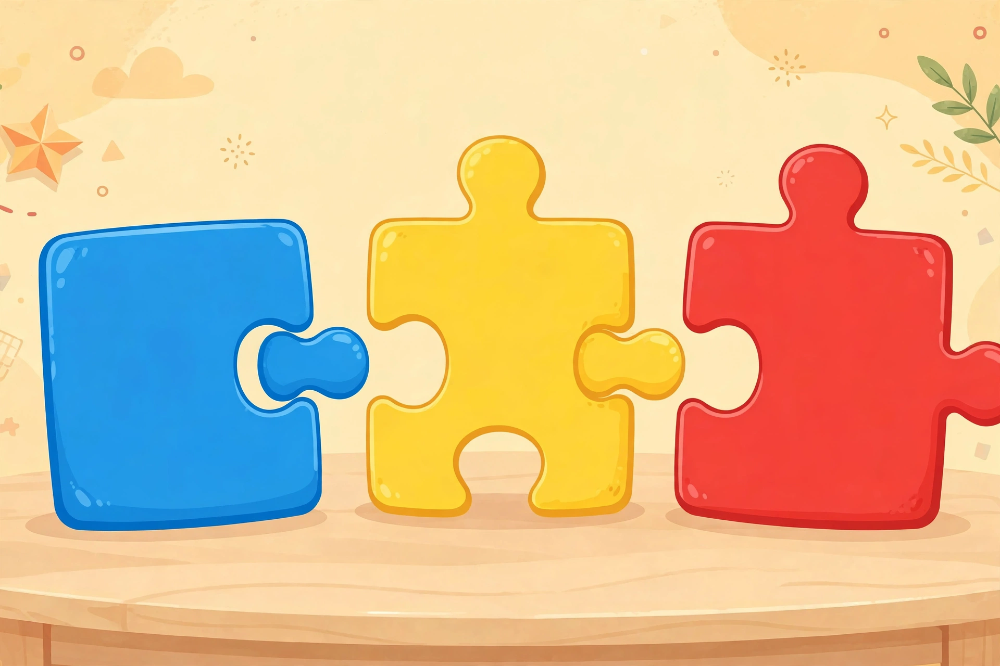

# Lesson 02 — Prefix Power: un-, re-, dis-, pre-

**Goal (learner hears):** "I can use a prefix's meaning to figure out what a
new word means."
**Time:** 25–30 minutes · **Materials:** the unit word sets; word cards the
adult writes by hand; the word-part puzzle image
([word-part-puzzle-pieces.png](../assets/word-part-puzzle-pieces.png)) —
**an AI-generated illustration**; blue, yellow, and red crayons or markers.
**Standards:** RF.3.3.a, L.3.4.b.

## Readiness check (1–2 min)

The adult says *happy*, then *unhappy*. "What changed at the front of the
word?" (*un-* was added.) "And what changed about the meaning?" (It flipped
to the opposite — not happy.) "A word part added to the *front* of a word
is called a **prefix**. Prefixes are like the blue puzzle piece — they always
come first, and they change what the rest of the word means."

## Explicit teaching

A **prefix** is a word part added to the beginning of a word. It changes the
word's meaning but never changes the part of speech by itself — and you can
use its meaning to predict the whole word's meaning. The strategy is
**prefix + known word = predicted meaning**, then check it against the
sentence.

The four prefixes of this lesson:

- **un-** means "not" or "the opposite of": *unhappy* = not happy,
  *unlock* = do the opposite of locking (open it).
- **re-** means "again": *replay* = play again, *rewrite* = write again.
- **dis-** means "not" or "the opposite of": *disagree* = not agree,
  *disappear* = the opposite of appear (go away).
- **pre-** means "before": *preview* = view before (see it early),
  *preheat* = heat before (warm the oven first).

Now look at the word-part puzzle image. Three pieces: **blue** on the left,
**yellow** in the middle, **red** on the right. The blue piece is the
*beginning* piece — that is where prefixes live. The yellow piece is the
*middle* piece — the root word, the part you already know. The red piece is
the *ending* piece — suffixes live there (Lesson 03). Every word we build
this week will follow blue → yellow → red, left to right, exactly the way we
read.

*Caption: An AI-generated illustration. Blue holds beginnings (prefixes),
yellow holds middles (roots), red holds endings (suffixes).*
*Text-only alternative: The three puzzle pieces are blue on the left,
yellow in the middle, and red on the right. Blue holds word beginnings
(prefixes), yellow holds the middle root word, red holds word endings
(suffixes).*

### Modeled example 1 — reread

*Adult writes* reread *and draws a blue box around* re- *and a yellow box
around* read, pointing to the blue then yellow puzzle pieces. "Blue piece:
*re-* — that means 'again.' Yellow piece: *read* — a word I know. Put them
together: *reread* = read again. Now check it in a sentence: 'I liked the
story so much that I reread it.' Does 'read again' make sense there?"
(Yes.) "Prefix + known word + sentence check — that is the whole strategy."

### Modeled example 2 — disagree, then preview

*Adult writes* disagree. "Blue piece: *dis-* — 'not' or 'opposite of.'
Yellow piece: *agree*. So *disagree* = not agree. Sentence: 'They disagree
about which game to play.' Not agreeing — it fits."
*Adult writes* preview. "Blue piece: *pre-* — 'before.' Yellow piece:
*view*. *Preview* = view before — see it early. Sentence: 'The preview
showed the funniest part of the movie.' Seeing part of it before the movie
— it fits." The adult points out that *preheat* works the same way, exactly
as the standard's example says.

## Guided practice (adult does it with the learner; 7 tasks)

1. Using the puzzle image: "Which piece would *un-* go on?" (Blue —
   beginnings.) "Which piece holds *kind* in *unkind*?" (Yellow — the
   middle, the root.) "So *unkind* means…?" (Not kind.)
2. "Strip the prefix from *rewrite*." (*re-* + *write*.) "What does it
   mean?" (Write again.) "Sentence check: 'Please rewrite your name so I
   can read it.'" (Fits.)
3. "*Dislike* — prefix, root, meaning?" (*dis-* + *like* = not like.)
4. **Odd one out:** *unhappy, unkind, under*. "Which one is not a real
   prefix + root word?" (*under* — the *un* is not a prefix here; it does
   not mean "not der." This is the classic trap: not every word that
   *starts* with these letters has a prefix.)
5. "*Prepay* — predict, then check: 'You must prepay for the tickets.'"
   (Pay before — fits.)
6. "Build three words with blue + yellow pieces: pick *un-, re-, dis-*
   and *tie, appear, heat*." (*untie* = do the opposite of tying — undo it;
   *disappear* = go away; *reheat* = heat again.) The learner physically
   sorts the cards under a drawing of the three puzzle pieces.
7. **Error-analysis:** the adult says "*unsafe* means 'safe again.'" "Am I
   right?" (No — *un-* means "not," so *unsafe* = not safe. You mixed up
   *un-* and *re-*.) "How do you know?" (The blue piece meaning: un- =
   not/opposite, re- = again.)

## Independent practice (learner tries; adult observes, 7 tasks)

1. Color-code: write *unfinished, reread, disconnect, predict* — blue
   under the prefix, yellow under the root. (un|finished, re|read,
   dis|connect, pre|dict.)
2. Predict meanings for: *unwrap, rebuild, dishonest, preheat*. (Open by
   removing wrapping; build again; not honest; heat before.)
3. Sentence check: "The magician made the coin *disappear*." Does
   "the opposite of appear" fit? (Yes — it went away.)
4. Sort 10 prefix word cards from the unit set into four piles: un-, re-,
   dis-, pre-.
5. "Which is a real prefix word: *relish* or *replay*?" (*replay* —
   re- + play. *Relish* is not re- + lish.)
6. Write two sentences using two different prefix words from today's sets;
   underline the prefix.
7. **Explain-your-reasoning:** "How does knowing *re-* = 'again' help you
   read *return*?" (re- + turn = turn again — go back.)

## Application

"Prefix workshop." The learner draws the three puzzle pieces on paper
(blue, yellow, red — red stays empty today, a preview of Lesson 03), then
builds 6 new prefix words by combining any prefix card with any root card
from the unit sets, writes each word across its pieces, and says the
predicted meaning aloud. At least one built word must be a real dictionary
word and one may be a playful invented word (the learner must defend why
its meaning follows the rules — e.g., *rebrush* = brush again).

## Exit check

The adult shows *disapprove* and *preheat* (unpracticed today). The learner
names the prefix, its meaning, the root, and the predicted meaning for
each: *dis-* = not/opposite of, *approve* → not approve; *pre-* = before,
*heat* → heat before. Success: both correct with the sentence check stated.

## Supports and extension

- **Reading/language access:** word cards with the prefix pre-colored blue;
  the learner says the meaning before reading the whole word.
- **Alternate response mode:** the learner may sort cards onto a printed
  copy of the puzzle image instead of writing.
- **Extension:** hunt the odd ones out — *uncle, ready, distant, pretty* —
  words that *look* prefixed but are not. Write the rule in your own words:
  "A prefix must leave a real word behind when you remove it."

## Teacher note (misconceptions)

The big trap is letter-matching without meaning: *under, uncle, ready,
relish, distant* look prefixed but are not. Teach the removal test — "take
off the prefix; is a real word left?" Learners also over-apply one meaning
("un- always means not," then stumble on *unlock* = opposite-of action);
both "not" and "opposite of" belong in the definition from day one. See
[teacher guide](../teacher-guide.md#lesson-02).
