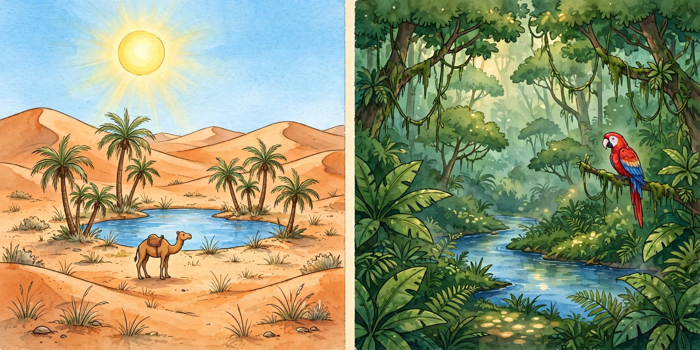

# Lesson 03 — Location and Environment: Why Places Differ

**Time:** two sessions, 30–35 minutes each · **Materials:** the generated
illustration `../assets/desert-rainforest-comparison.png` (printed or on
screen), a world map with the equator marked, the unit vocabulary word cards
(desert, oasis, rainforest, canopy, equator, latitude)

**Goal (read to the learner):** Today you will compare two real world
regions — the Sahara Desert and the Amazon rainforest — and explain how each
place's location connects to its heat, rain, and plant and animal life.

**Readiness check:** Adult: "Which is wetter — a desert or a rainforest?
How do you know?" Accept anything close to: deserts are dry, rainforests
are wet. If stuck, point to the illustration's two halves: "Look — sand on
this side, river and thick trees on the other. What does that tell us?"

## Teaching (adult reads and models)

Geographers ask: **where is a place, and how does "where" shape what it is
like?** A place's **location** — especially its **latitude**, how far north
or south of the **equator** it is — connects to its **environmental
characteristics**: how hot it is, how much it rains, and what can live there.

**Region 1 — the Sahara.** The Sahara is the largest hot desert on Earth,
stretching across northern Africa. A **desert** is a dry region that gets
very little rain. The Sahara gets almost no rain; days are very hot and
nights turn cool. Most of it is rock and gravel with some famous sand dunes.
Where fresh water reaches the surface, green **oases** appear — palm trees
and crops grow only there. Camels and fennec foxes survive by saving water.

**Region 2 — the Amazon.** The Amazon is the world's largest rainforest,
across nine countries in South America. A **rainforest** is a very wet forest
near the equator with dense trees and huge wildlife. The Amazon sits close
to the **equator**, where the sun shines strongly all year and warm, moist
air brings rain nearly every day. Its trees grow in layers — the top layer is
the **canopy** — and scarlet macaws, sloths, jaguars, and millions of insects
live in those layers.

Now the connection: **why are they so different?** Both regions are in the
warm part of the world — but rain is the divider. The Amazon gets the sun's
heat *plus* steady rain, so it grows thick and green. The Sahara gets the
sun's heat with *almost no rain*, so it stays dry and sandy. Location brings
the sun; what the air does with moisture decides the rest. Geographers say:
**environmental characteristics vary among world regions because location,
latitude, and rainfall patterns differ.**

Study the illustration. This is an **AI-generated illustration** of two
imaginary-but-realistic scenes — a teaching picture, not a photograph of a
real place.

> 
>
> *Caption: An AI-generated illustration comparing two world regions — a hot
> desert (left) and a tropical rainforest (right). A teaching picture, not a
> real place.*
>
> **Text-only alternative (same information, no picture needed):** The
> illustration is split in two. The left half shows a desert: rolling orange
> sand dunes, a few palm trees around a small blue pond (an oasis), one camel,
> a bright high sun, and pale blue sky. The right half shows a rainforest:
> tall green trees in dense layers, a winding blue river, one colorful
> scarlet macaw on a branch, big green leaves and ferns. Left = dry and
> sandy; right = green and wet.

**Worked example 1 — reading evidence from the picture:**

> Adult: "I see sand dunes and only a few palm trees near one small pond on
> the left. That tells me water is rare here — a desert. On the right I see
> a wide river and trees packed in layers, so water is everywhere — a
> rainforest. Same sun above both scenes; different water, different life.
> My claim: water decides the difference. My evidence: the pond vs. the
> river, the few palms vs. the dense canopy."

**Worked example 2 — linking location to environment:**

> Adult points at the world map: "The Amazon sits near the equator — strong,
> direct sun all year, plus rain almost every day. Result: hot AND wet, so a
> rainforest. The Sahara sits farther north of the equator, where dry air
> sinks and brings almost no rain. Result: hot AND dry, so a desert. Both
> get strong sun — location decides the rain, and rain decides the plants
> and animals."

Key idea to say plainly: **A place's location — how far north or south of
the equator it is, and what the air does with moisture there — shapes its
heat, rain, and living things. That is why world regions look so different
from each other.**

## Guided practice (adult leads, learner decides)

1. "Point to three clues in the illustration that the left side is dry."
   *(dunes, one small pond, few plants, camel)* "Three clues the right side
   is wet?" *(river, dense layered trees, ferns)*
2. "Where is the Amazon on the world map — near the equator or far from
   it?" *(near)* "Where is the Sahara?" *(north of the equator, in northern
   Africa)*
3. "If a place gets strong sun AND lots of rain, what grows? If it gets
   strong sun and almost NO rain?" *(rainforest; desert)*
4. Error-analysis: "A friend says, 'The Sahara has no water at all and
   nothing lives there.' Use evidence to fix that sentence." *(Oases have
   fresh water; camels, fennec foxes, and ~1,200 plant species live there —
   life adapts to dryness.)*
5. "Why can't we say the illustration *proves* deserts look exactly like
   this?" *(It is an AI-generated teaching picture, not a photograph; real
   deserts also have rock plains, mountains, and towns — the picture shows
   one typical scene.)*

## Independent practice

The learner completes a two-column evidence chart: **Sahara** | **Amazon**,
with rows for *location (continent, near/far from equator)*, *rain*,
*plants*, *animals*, *one sentence: how location connects to environment*.
Success: each row has at least one evidence-based entry; the final sentence
names location AND rain/heat.

## Application

"An explorer lands somewhere new and reports: 'It is hot, it rains every
afternoon, and the trees are so thick I cannot see the sky.' Is this place
more like the Sahara or the Amazon? What is your evidence?" (Amazon —
evidence: daily rain + dense canopy.)

## Exit check

Prompt: "Why are the Sahara and the Amazon so different even though both
are in warm parts of the world?" Accept: location and rainfall differ — the
Amazon gets steady rain near the equator so it is wet and green; the Sahara
gets almost no rain so it is dry and sandy. Full credit names both heat and
water.

## Supports and extensions

- **Support:** Pre-fill the chart's location row; the learner fills the
  rest. Let the learner sort picture cards (camel, macaw, dune, river)
  into "dry" and "wet" piles instead of writing.
- **Reading/language access:** Teach *oasis* and *canopy* with the picture
  first, word card second. Sentence starters: "This place is \_\_\_ because
  \_\_\_."
- **Alternate response mode:** Oral evidence chart (adult scribes); or the
  learner narrates a "tour guide" recording of the illustration.
- **Extension:** The learner picks a third region (e.g., Antarctica — cold
  desert) and predicts its rain/plant/animal pattern from its latitude,
  then checks with the adult.

## Teacher note

**Likely misconception:** "desert = hot sand everywhere" (learners picture
only dunes). Re-anchor: most of the Sahara is rock and gravel; Antarctica is
a desert too — a desert means *dry*, not *hot*. Second slip: thinking the
illustration is a photograph of a real place — repeat the AI-illustration
label; it shows typical features, not one real location. Keep the latitude
explanation qualitative (near/far from the equator); save Hadley cells for
later grades.
**Answer-key reference:** [answer-key.md](../answer-key.md) (Lesson 03).
