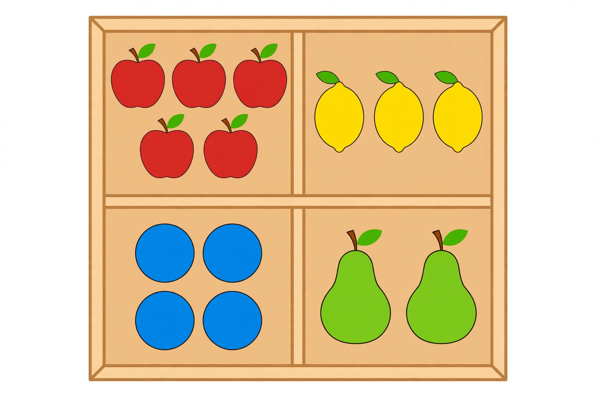

# Lesson 02 — Sorting by Color and Size

**Student goal:** I can put alike things together, tell the sorting rule, and
count each group.
**Time:** 15–20 minutes · **Unit:** [U01](../README.md) · **Session 5 of 16**

## Materials

- 10–12 mixed counters in 2 colors (e.g., red and blue buttons) and 2 sizes
- 2–3 trays, bowls, or shoebox lids
- The generated illustration
  [`assets/counting-sorting-tray.png`](../assets/counting-sorting-tray.png)

## Readiness check (1 minute)

"Touch and count these 5 blocks" (quick re-check of Lesson 01). Then: "Show me
a red one. Show me a big one." The learner needs color/size words before
sorting by them.

## Teaching

**Sorting** means putting together the things that are alike. First we decide
the rule — "we are sorting by **color**" or "we are sorting by **size**" — and
then every object goes with its group. Things in the same group are the
**same** in the way we chose. Things in different groups are **different** in
that way.

## Worked example 1 — sorting buttons by color (adult models)

The adult spreads 6 mixed red and blue buttons.

> "My rule is **color**. Watch: red goes here." *(moves a red button to the
> left tray)* "Another red — same tray." *(moves it)* "Blue — different tray."
> *(moves a blue button to the right tray)*
> "Red, red." *(finishes the reds)* "Blue, blue, blue." *(finishes the blues)*
> "Now I count each group. Reds: 1, 2, 3 — three reds. Blues: 1, 2, 3 —
> three blues. Same number!"

**Reasoning to name aloud:** the rule comes first, then every object follows
the rule. Counting each group after sorting tells us how many are alike.

## Worked example 2 — the sorting-tray picture

Show the illustration:

*Caption: An AI-generated sorting tray. The fruit and balls are already sorted
by kind into four boxes — count each box.*

The adult reads the **text alternative** (the facts the picture shows): "This
tray has four boxes. Top-left: 5 red apples. Top-right: 3 yellow lemons.
Bottom-left: 4 blue balls. Bottom-right: 2 green pears."

> "The rule here is **kind of fruit — and the balls are their own kind**.
> Point to each box and count with me. Apples: 1, 2, 3, 4, 5 — five apples.
> Lemons: 1, 2, 3 — three lemons. Balls: 1, 2, 3, 4 — four balls. Pears:
> 1, 2 — two pears. Which box has the most? The apples, with five. Which has
> the fewest? The pears, with two."

**Reasoning to name aloud:** sorted groups make counting easy — nothing is
counted twice because each thing has exactly one home. Comparing the four
counts tells us most and fewest.

*Text-only alternative (same information, no picture needed):* A tray has 4
boxes — 5 red apples, 3 yellow lemons, 4 blue balls, 2 green pears.

## Guided practice (adult stays close, hints allowed)

1. Sort 8 mixed red/blue crayons into two trays by **color**. "What is your
   rule?" *(Expected: "color — reds here, blues here.")*
2. Count each crayon group. "How many reds? How many blues?"
3. Sort 6 blocks (3 big, 3 little) by **size**. *Hint: "Hold two next to each
   other. Which is bigger?"*
4. Count each size group.
5. The adult sorts 5 buttons by color but "accidentally" drops a blue button
   in the red tray. "Check my sorting. Did I follow the rule?" *(Error
   analysis: expected — "no, that blue one goes with the blues.")*
6. Picture round: "Point to the box with 4 things. What are they?"
   *(Expected: bottom-left, blue balls.)*

## Independent practice

The learner gets a fresh mixed set (10 objects, 2 colors) and two trays,
sorts alone, counts each group, and tells the adult the rule and the two
counts: "I sorted by color. Four reds, six blues." The adult observes whether
each object landed in exactly one group.

*Alternate response mode:* the learner points to where each object belongs
and the adult moves it; or the learner sorts by pushing objects into drawn
circles on paper.

## Application

Laundry sort: with an adult, sort a small pile of socks by **owner** (whose
feet?) or by **color**. "What is our rule? Count each group." Sorting rules
run the household — this is the same thinking.

## Exit check

The adult pre-sorts 4 objects: 3 yellow and 1 green. "Tell me the sorting
rule, and count each group." Expected: "color — three yellow, one green."

## Supports

- **Language access:** hold up two objects that differ only in the sorting
  attribute ("same color? different color?") before naming the rule word.
- **Alternate response mode:** pointing to the destination tray instead of
  moving objects; sorting large picture cards instead of small counters.
- **Floor-play variant:** sort stuffed animals into two blanket "trays" by
  size — big friends here, little friends there.
- Color is never the only cue in checks: the guided rounds also use size, and
  the illustration activity is backed by the text alternative.

## Extension

Sort by two attributes at once: "big reds here, little reds here, big blues
here, little blues here" (four groups). Or invent a new rule — "sort by
shape" — and defend it.

## Teacher note

**Likely misconceptions:** (1) sorting by a different attribute halfway
through ("these are red... this one is big") — restate the rule before each
placement; (2) leaving an object unsorted because it "doesn't fit" — every
object gets a group; make a "doesn't fit" group only to discuss why, then
re-sort; (3) counting a group by recounting across groups — count one group
fully before starting the next.

**Answer-key reference:** [answer-key.md](../answer-key.md#lesson-02) — guided
error-analysis round, picture-round answers, and exit-check responses.
