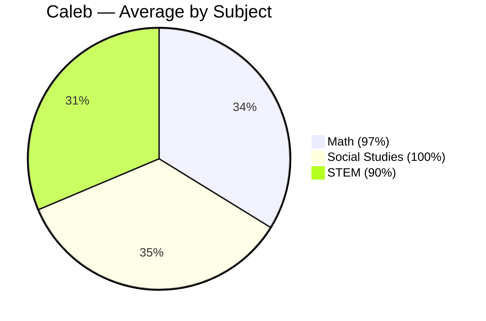
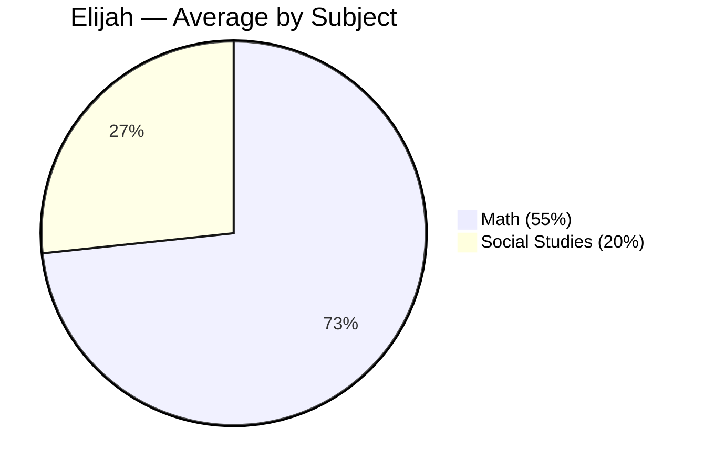

# Progress Charts — As of 2026-06-05

Visual summaries of scores and completion based on merged assignments.

---

## At-a-Glance Averages

| Student | Math | Social Studies | STEM | Overall |
| --- | ---: | ---: | ---: | ---: |
| Caleb (G7) | 97% | 100% | 90% | 96% |
| Elijah (G4) | 55% | 20% | — | 43% |

---

## Mermaid Pie Charts

Caleb — Average by Subject



Elijah — Average by Subject



---

## Assignment Score Bars

Legend: each block ≈ 5%

Caleb (G7)

```
Math — 2026-03-20   | ███████████████████░ (95%)
Math — 2026-03-27   | ███████████████████░ (95%)
Math — 2026-04-03   | ████████████████████ (100%)
SS   — 2026-03-20   | ████████████████████ (100%)
SS   — 2026-03-27   | ████████████████████ (100%)
SS   — 2026-04-03   | ████████████████████ (100%)
STEM — Week‑01       | ██████████████████░░ (90%)
STEM — Week‑02       | ██████████████████░░ (90%)
```

Elijah (G4)

```
Math — 2026-03-20   | ███████░░░░░░░░░░░░ (55%)
SS   — 2026-06-05   | ███░░░░░░░░░░░░░░░░ (20%)
```

---

## Completion Counts

| Student | Math | Social Studies | STEM | Total |
| --- | ---: | ---: | ---: | ---: |
| Caleb | 3 | 3 | 2 | 8 |
| Elijah | 1 | 1 | 0 | 2 |

---

## Links

- Report Cards: ./2026-06-05_report-cards.md
- Grader Prompt: ../ai-assistants/assessment_grader.md
- Key Resource: ../../resources/weights_and_measures.md
